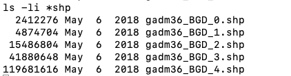
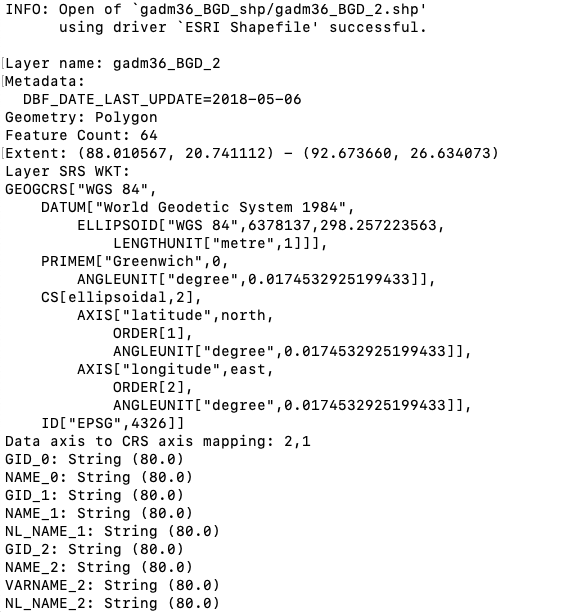
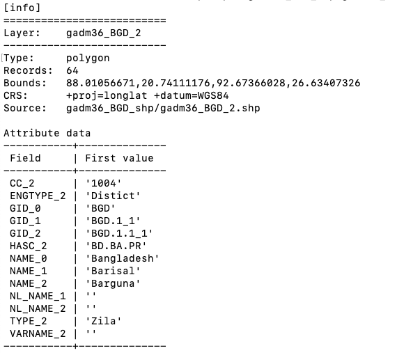
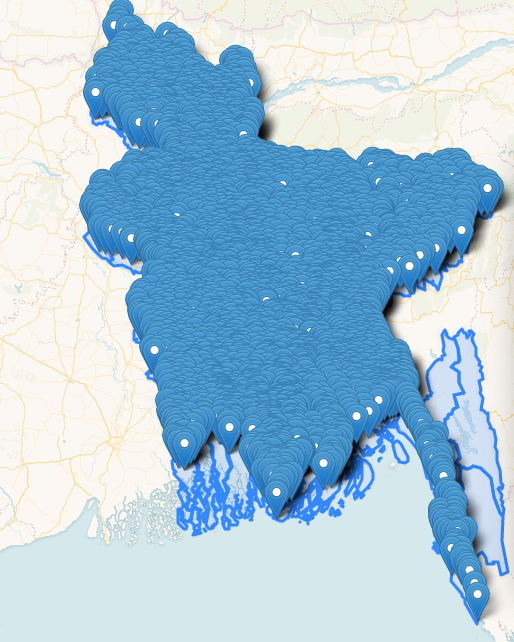
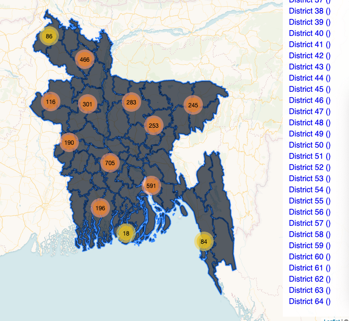
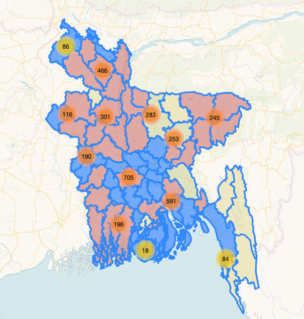
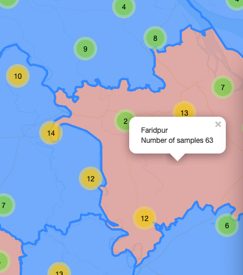
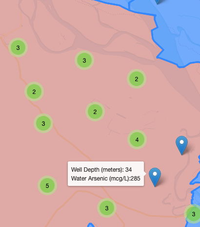

# bgd-waterquality

# Overview

This map visualizes data from the <a href="https://www.bgs.ac.uk/research/groundwater/health/arsenic/Bangladesh/data.html" target="_blank">British Geological Survey (BGS)</a> about water quality in Bangladesh.

# Summary of Datasets Used

* Point Data: <a href="https://www.bgs.ac.uk/downloads/start.cfm?id=2214" target="_blank">DPHE/BGS National Hydrochemical Survey</a>
* Polygon Data: <a href="https://biogeo.ucdavis.edu/data/gadm3.6/shp/gadm36_BGD_shp.zip" target="_blank">Bangladesh administrative boundaries - GADM v 3.6</a>

# Dataset Processing

The specific dataset used in this map is called <a href="https://www.bgs.ac.uk/downloads/start.cfm?id=2214" target="_blank">DPHE/BGS National Hydrochemical Survey</a> and is available as a csv file, 850 KB.


The BGS website has lots of maps and information about the dataset. The goal for this current map is to make an interactive site that displays some of the specific information for each sampled borehole.


The dataset needs to be edited before loading into a map. The original csv file has some very helpful metadata information that we can move out of the document.


The dataset information in the header is:

```
BGS,  DFID,  DPHE
Groundwater Studies of Arsenic Contamination in Bangladesh
National Survey Data
Release date: 25 May 2000
```

We can also reduce the spacing between the column headers and the dataset.


These changes were made in a spreadsheet application and were not made using a command line approach. 

The column header information has been combined, for example WELL_DEPTH_m now contains the information about meter depth (m) within the column header.

Another piece to note is the Division, District, Thana, Union, and Mouza administrative unit information for each sample. This information will be helpful for a merge that we'll try once we collect the shapefiles.

This dataset does have latitude and longitude data already available (in WGS 84), so maps could be made using the point data. For the purposes of this map, we'll add in some polygon data described in the next section.

# Polygon Data

The site <a href="https://gadm.org" target="_blank">GADM</a> has administrative unit polygons available for countries. Navigating to the data <a href="https://gadm.org/download_country_v3.html" target="_blank">download page</a> provides access to the Bangladesh dataset.


Selecting this option displays this page.


There are five administrative levels listed. Level-0 corresponds to the country outline.

This is the direct link for the <a href="https://biogeo.ucdavis.edu/data/gadm3.6/shp/gadm36_BGD_shp.zip" target="_blank">Bangladesh shapefile zip folder</a>.

The zip folder is over 68 MB in size and this file size may be difficult to map all at once.


# Polygon Processing

Several editing steps were needed for this original zip file.

Within the data directory, the file needs to be unzipped. A new directory needs to be created, and all the unzipped files need to be stored in this new folder.

```
unzip gadm36_BGD_shp.zip
mkdir gadm36_BGD_shp
mv gadm36_BGD_0* gadm36_BGD_shp
mv gadm36_BGD_1* gadm36_BGD_shp
mv gadm36_BGD_2* gadm36_BGD_shp
mv gadm36_BGD_3* gadm36_BGD_shp
mv gadm36_BGD_4* gadm36_BGD_shp
```

Within this new folder, the file sizes of these shp files vary.

```
-ls li *.shp
```

As the administrative unit becomes more specific, the polygons become more complex and the file size increases.



The selected option to try is the BGD_2 which contains the polygons for districts in Bangladesh. There are 64 districts.


# Converting to json

To convert the csv file to a geojson, a new script was created using csv2geojson.

```
npm install csv2geojson
touch csv2geojson.js
node csv2geojson.js
```

The node command was run after the following script was created. Note that the newly formatted csv file is used with the column names taking up one row. The latitude and longitude information is stored in the LAT_DEG and LONG_DEG fields. The file is written out as a .json file.

```javascript
 "use strict"

var fs = require('fs');
var csv2geojson = require('csv2geojson')

// read file as string
fs.readFile('../data/NationalSurveyData_MapFormat.csv', 'utf-8', (err, csvString) => {

    if(err) throw err;

    // convert to GeoJSON
    csv2geojson.csv2geojson(csvString, {
        latfield: 'LAT_DEG',
        lonfield: 'LONG_DEG',
        delimiter: ','
    }, (err, geojson) => {
    
        if(err) throw err;

        console.log(geojson); // this is our geojson!
        
        // write file
        fs.writeFile('../data/NationalSurveyData_MapFormat.json', JSON.stringify(geojson), 'utf-8', (err) => {
            
            if(err) throw err;
            
            console.log('done writing file');
        });
    })
});
```

How about converting the newly extracted .shp file to a .json? Another script attempted to process this using node, but instead a command line solution was used.

For an attempt using node, a new script was created called shptojson.js.

The code was as follows:

```javascript
"use strict"

var mapshaper = require('mapshaper')

mapshaper data/gadm36_BGD_shp/gadm36_BGD_2.shp -simplify dp 20% -o format=geojson data/gadm36_BGD_shp/gadm36_BGD_2.json
```

After getting some error messages, the command was moved to the command line to process the shp data to a json.


```
mapshaper data/gadm36_BGD_shp/gadm36_BGD_2.shp -simplify dp 20% -o format=geojson data/gadm36_BGD_shp/gadm36_BGD_2.json
```

The end result is two new .json files that can be mapped. The csv file and the BGD_2 shp file (district level) have been successfully converted to .json files and can now be mapped.

# Creating counts

With the two newly created .json files, additional modifications can be processed where we count the number of sampled boreholes within each district. These steps require some additional npm packages and scripts.

First, the csv-parse package was downloaded.

```
npm install csv-parse
```

Next, a new script was created.

```
touch bind-data-js.js
```

But which columns in the dataset provide the correct information for counting? The data row names were checked using ogrinfo and mapshaper. Note the NAME_2 column, this is the column that corresponds to the district name.

```
ogrinfo gadm36_BGD_shp/gadm36_BGD_2.shp gadm36_BGD_2 -so
```



This information is also checked using mapshaper. A benefit of using mapshaper is you can see the first value of the NAME_2 column which is a district name.

```
mapshaper gadm36_BGD_shp/gadm36_BGD_2.shp -info
```



Remember back to the edited csv file. The district name is included in a column named District.


The two key columns that can be used for counting the number of sampled boreholes is NAME_2 for the .json and District for the .csv file.

This information was entered into the bind-data-js script.

```javascript
import fs from 'fs';
import csvParse from 'csv-parse';

// request first file
fs.readFile('../data/gadm36_BGD_shp/gadm36_BGD_2.json', 'utf8', (err, geojson) => {
  
  if (err) throw err;
  // nested call for the second (could use Promise or async solution)
  fs.readFile('../data/NationalSurveyData_MapFormat.csv', 'utf8', (err, csvString) => {
    
    if (err) throw err; // stop the script if error

    // parse the CSV file from text to array of objects
    csvParse(csvString, {
      columns: true
    }, (err, csvData) => {
      
      bindData(JSON.parse(geojson), csvData);

    });
  })
});

function bindData(geojson, csvData) {

  // loop through the features
  geojson.features.forEach((feature) => {

    // set a variable to 0
    let count = 0;

    // loop through the array of CSV data objects
    csvData.forEach((row) => {

      // if IDs match
      if (feature.properties.NAME_2 === row.DISTRICT) {
        // increment the count for that feature
        count++
      }

    });

    // when done looping, add the count as a feature property
    feature.properties.count = count;

  });

  // done with data bind
  writeFile(geojson);

}

function writeFile(geojson) {

  fs.writeFile('../data/BGD-districts-counts.json', JSON.stringify(geojson), 'utf8', function (err) {

    if (err) throw err;

    console.log('File all done. Great success!');
  })

}

```

This code was run using the following command
```
node bind-data-js
```

The result was a count of the number of boreholes sampled per district added as a new variable named count.

# Mapping colors

Additionally, code was run to select out a color palette for the map. From the originally provided cartocolors.json file, the selected color palette was called Temps.

A new js file was created colorselection.js and within this file the following code was entered. The result of running this code was creating a new .json file called tempscolors.json. This file contained the color palette used in the map.

```javascript
// import the modules
import fs from 'fs';
import chalk from 'chalk';

// read the file into the script with the readFile() method,
// designating utf-8 character encoding
fs.readFile('../data/cartocolors.json', (err, data) => {

  // if there is an error loading the data, throw an error 
  if (err) throw error;
  
  // otherwise, you have access to data here
  // we can log the buffer to the terminal
  console.log(chalk.green("data loaded!"));
  
  // or send the parsed data as an argument to another function
  extractScheme(JSON.parse(data));
})

function extractScheme(data) {
  // create a new object with key 'Vivid' and value the object
  var outputData = {
    'Temps': data['Temps']
  };
  
  writeOutputFile(outputData)
}

function writeOutputFile(outputData) {

  // write the data to a new file using the writeFile() method, stringifying the JS object
  fs.writeFile('../data/tempscolors.json', JSON.stringify(outputData), 'utf-8', function (err) {
    if (err) throw err;
    
    console.log(chalk.blue('super cool, file written.'));
  });
}
```

```
node colorselection.js
```

# Mapping components summary

After the steps outlined above, the following .json files were available for mapping.

* data/BGD-districts-counts.json
* data/tempscolors.json
* data/NationalSurveyData_MapFormat.json

These files contains the counts of sampled boreholes by district, the color palette used, and the point data for sampled boreholes. Note, a jquery error was encountered with the NAME_2 field in the BGD_districts-counts.json. A district is named Cox's Bazar, and it seemed the apostrophe s was causing jquery to throw an error. Temporarily renaming to Coxs Bazar allowed the map to load, but didn't address the issue of an apostrophe in a district name.

# Initial mapping examples

The json files were created correctly from the original csv and shp files, as a preliminary map shows the districts and all the mapped sampling locations.



After some initial editing to the html file, the number of districts seemed to be too many for mapping on the right side legend.



Another option would be to have the districts color coded by the number of water samples collected in each district. A dropdown menu could be added with the district names so that they could be viewed individually rather than in one larger list.



Additional features were added to the map, including the number of boreholes sampled per district as a popup.



The test results for water arsenic concentration for each borehole were also indicated with the borehole depth.




# Key commands used

In addition to the commands noted above, some additional commands that were useful during the data processing are noted here too. 


```
mkdir <name>
```
This command was used to create directories (folders) after the project was initialized.

```
touch index.html
```
This command was used to create files, such as the index.html page.


```
mv <oldfilename> <newfilename>
```

This command was used to rename a file within the same folder. When taking screen images, the image files were automatically named by the computer. These files were renamed using the mv command.

```
ls -li
```

This command was used to list the contents of folders and information about file sizes.

```
cd data
cd ..
```

This command was used to change the working directory. For example, moving into the data directory or if .. is used, moving up the directory one level.


```
git status
git add <filenames>
git commit -m "description of what is being added"
git push
```

This series of commands was used to upload edits to the remote repository. The git status command provided an updated on which files were being tracked and which ones needed to be tracked. If files needed to be tracked so that they could be uploaded to the remote repository, the git add command was run, using either one or multiple file or folder names. Then the git commit command was run, and a message was included to indicate what kind of update was occurring. Finally, the git push command pushed all these updates to the remote repository.
