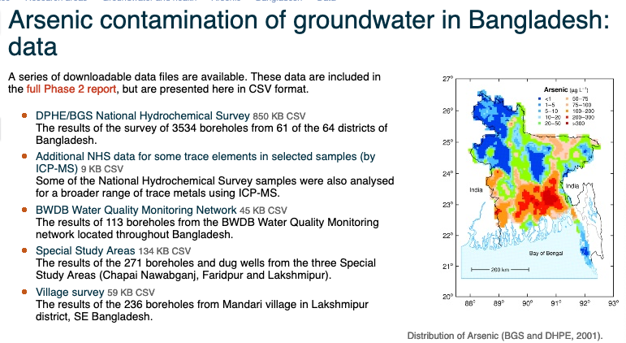
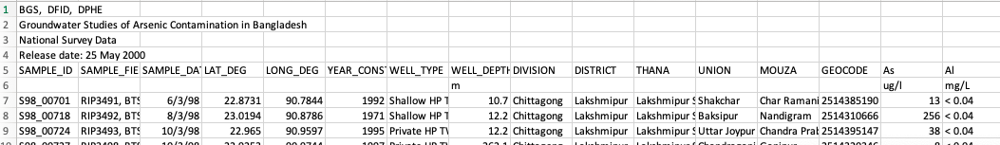
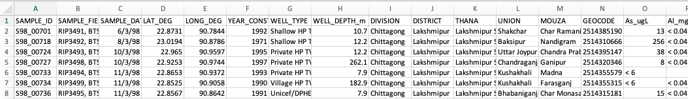
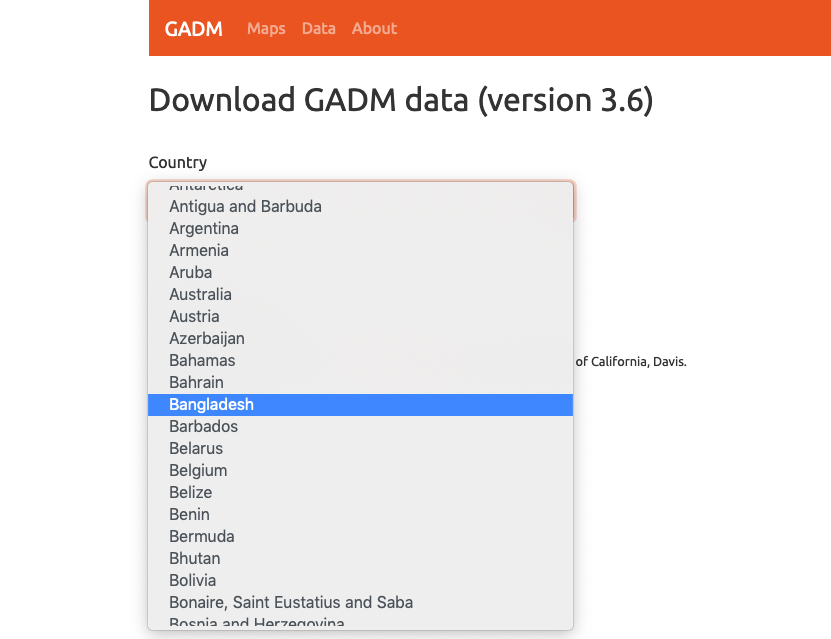
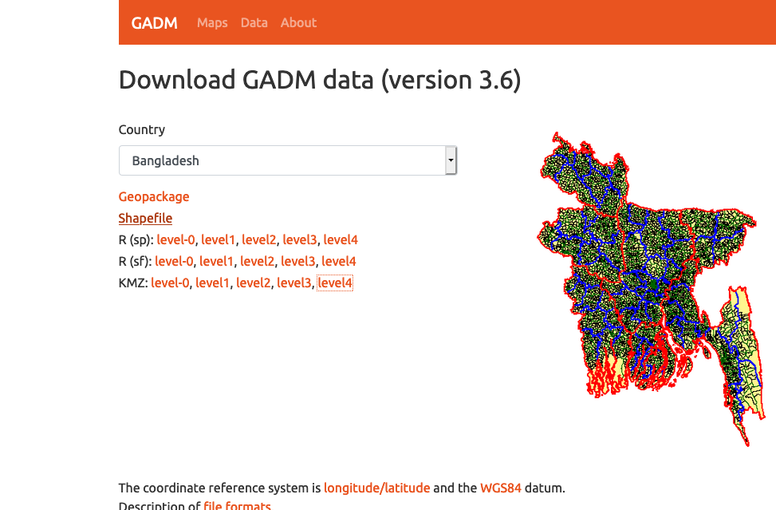

# bgd-waterquality

# Overview

This map visualizes data from the <a href="https://www.bgs.ac.uk/research/groundwater/health/arsenic/Bangladesh/data.html" target="_blank">British Geological Survey (BGS)</a> about water quality in Bangladesh.

# Summary of Datasets Used

* Point Data: <a href="https://www.bgs.ac.uk/downloads/start.cfm?id=2214" target="_blank">DPHE/BGS National Hydrochemical Survey</a>
* Polygon Data: <a href="https://biogeo.ucdavis.edu/data/gadm3.6/shp/gadm36_BGD_shp.zip" target="_blank">Bangladesh administrative boundaries - GADM v 3.6</a>

# Dataset Processing

The specific dataset used in this map is called <a href="https://www.bgs.ac.uk/downloads/start.cfm?id=2214" target="_blank">DPHE/BGS National Hydrochemical Survey</a> and is available as a csv file, 850 KB.



The BGS website has lots of maps and information about the dataset. The goal for this current map is to make an interactive site that displays some of the specific information for each sampled borehole.


The dataset needs to be edited before loading into a map. The original csv file has some very helpful metadata information that we can move out of the document.



The dataset information in the header is:

```
BGS,  DFID,  DPHE
Groundwater Studies of Arsenic Contamination in Bangladesh
National Survey Data
Release date: 25 May 2000
```

We can also reduce the spacing between the column headers and the dataset.



These changes were made in a spreadsheet application and were not made using a command line approach. 

The column header information has been combined, for example WELL_DEPTH_m now contains the information about meter depth (m) within the column header.

Another piece to note is the Division, District, Thana, Union, and Mouza administrative unit information for each sample. This information will be helpful for a merge that we'll try once we collect the shapefiles.

This dataset does have latitude and longitude data already available (in WGS 84), so maps could be made using the point data. For the purposes of this map, we'll add in some polygon data described in the next section.

# Polygon Data

The site <a href="https://gadm.org" target="_blank">GADM</a> has administrative unit polygons available for countries. Navigating to the data <a href="https://gadm.org/download_country_v3.html" target="_blank">download page</a> provides access to the Bangladesh dataset.



Selecting this option displays this page.



There are five administrative levels listed. Level-0 corresponds to the country outline.

This is the direct link for the <a href="https://biogeo.ucdavis.edu/data/gadm3.6/shp/gadm36_BGD_shp.zip" target="_blank">Bangladesh shapefile zip folder</a>.


